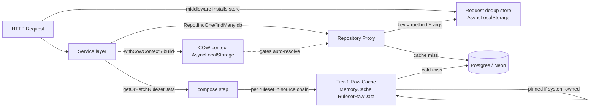
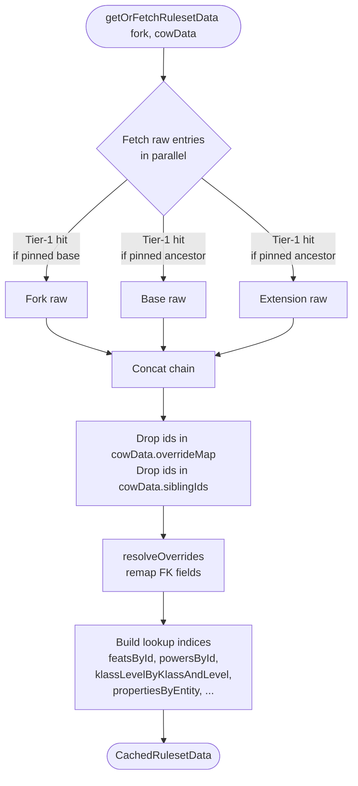
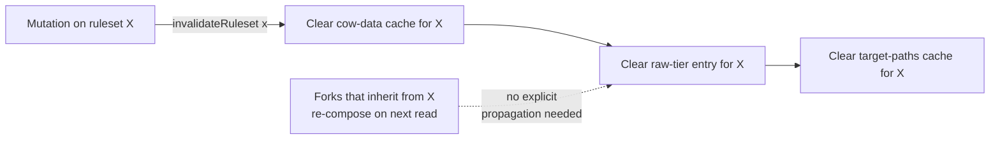
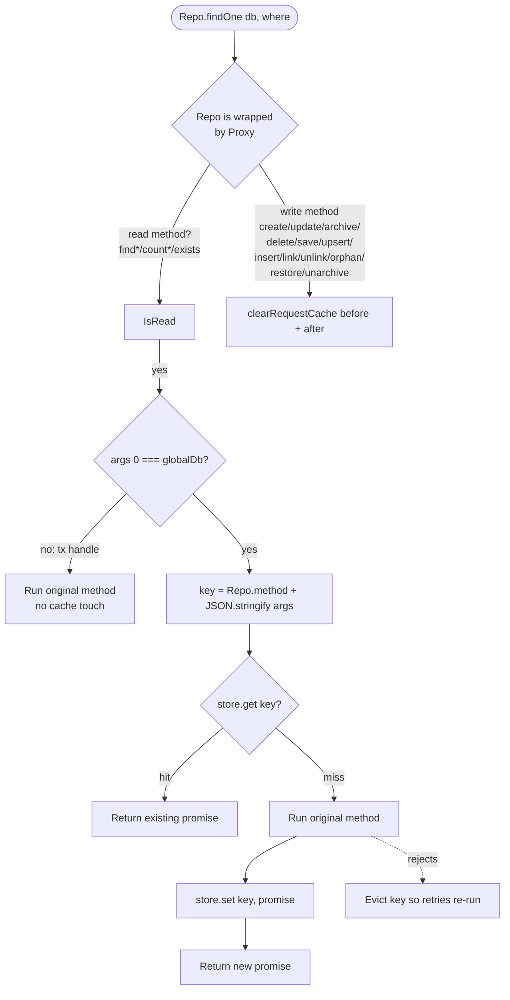
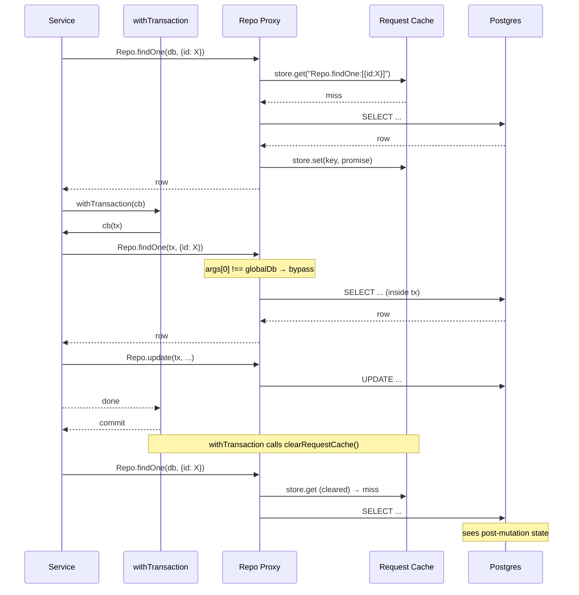
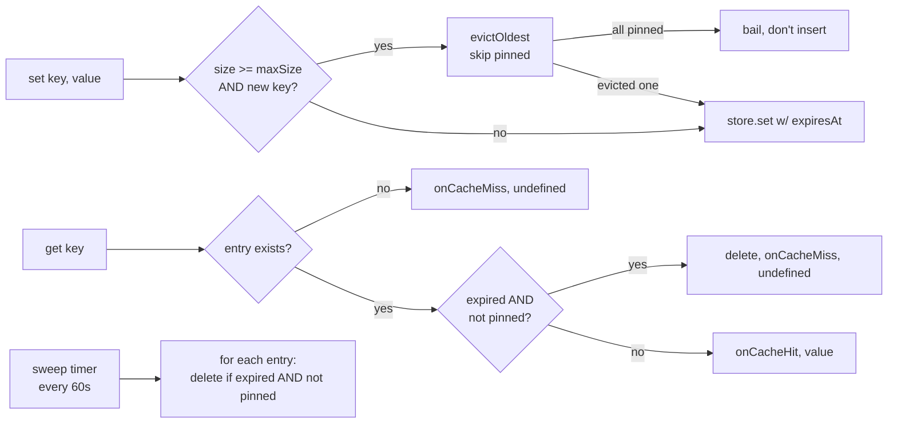
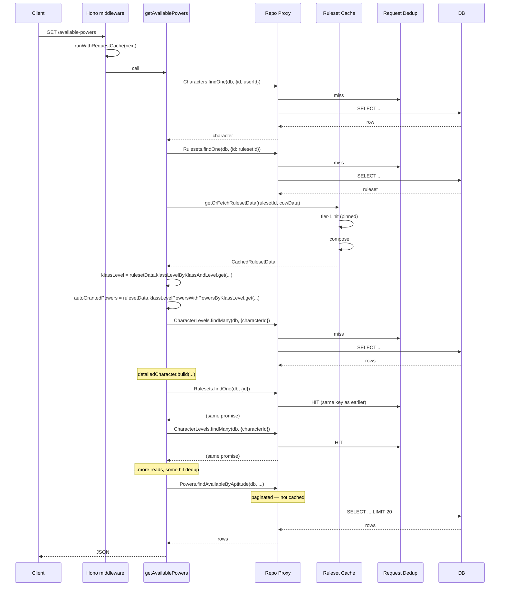

# Caching

## Overview

The server runs three cooperating layers, each solving a different problem:

| Layer | Scope | Lifetime | Shared by | Purpose |
|---|---|---|---|---|
| **Ruleset cache** | Per ruleset | Cross-request; pinned for system-owned | All requests for that ruleset | Avoid re-reading the same ~thousand entity rows on every character read |
| **Request-scoped dedup** | Per HTTP request | One request | Any code in that request | Collapse accidental duplicate queries (same SELECT, same args) fired by different layers in a single request |
| **COW context** | Per ruleset-scoped operation | One async scope | The repos + cache inside that scope | Auto-remap stored pre-COW ids to post-COW so callers don't need to canonicalize manually |

The first two are in-memory data stores; the third is an AsyncLocalStorage-backed context that activates resolution behavior on the other two. Nothing is persisted. On process restart, everything is cold.

## How services interact with this

Services never call the cache or COW plumbing directly. The single entry point is one of two helpers from `server/services/rulesets/cow.ts`:

```ts
// Single-ruleset operation (every CRUD, character-scoped action):
return await withRulesetScope(tx, rulesetId, async ({ ruleset, rulesetData }) => {
  // ... read / write anything. Auto-COW is on.
});

// Multi-ruleset list enrichment (getMyCharacters / getCampaignCharacters):
return await withRulesetScopes(db, rulesetIds, async (rulesetDataByRulesetId) => {
  // ... stitch results from several rulesets. No ambient context
  // since only one can be active at a time; lookups use the map.
});
```

Inside the scope:
- `ruleset` — the ruleset row (non-null; throws `NotFoundError` if missing).
- `rulesetData` — the composed cache: `*ById` Maps, `klassLevelByKlassAndLevel`, `propertiesByEntity`, etc. Also `rulesetData.cow` exposes the underlying `cowData` (sourceChain, overrideMap, siblingMap) for lineage checks.
- A `cowContext` is activated, which turns on three automatic behaviours in the repository Proxy:
  1. **Input canonicalization** — `Items.findOne({ id: preCowId })` rewrites `id` to post-COW before hitting Postgres.
  2. **Output FK resolution** — returned rows have every `*Id` field remapped to post-COW.
  3. **Composite-key expansion** — `CharacterAbilities.update(tx, values, { characterId, abilityId })` matches both the pre-COW stored row and post-COW client input through `BaseRepository.idMatches`.

**Callers don't think about COW for lookups.** `rulesetData.featsById.get(id)` works whether `id` is pre-COW or post-COW. Character-scoped repo reads (`CharacterLevels.findMany`, etc.) return rows whose `*Id` fields are already post-COW when they happen inside a scope. The only place you reach past the scope is ruleset management (fork/publish in `RulesetsService`) and framework internals (`DetailedCharacterDataLoader` for PMR distribution, `TargetPathsService` for path generation) — both are covered by `@internal` helpers described below.



## COW Transparency

### The problem

Ruleset entities can be [Copy-On-Write'd](./rulesets.md) in a fork. A COW creates a new entity with a new id; the `overrideMap` records `preCowId → postCowId`. Characters saved **before** a COW store pre-COW ids in their rows (`character_level_feats.feat_id`, `character_abilities.ability_id`, ...). The composed ruleset cache is keyed by **post-COW ids**.

Without intervention, every lookup site had to remember to do `rulesetData.featsById.get(overrideMap.get(storedId) ?? storedId)`. Missing a call produced a silent cache miss. Three layers close the gap automatically.

### Layer 1 — cache id Maps auto-resolve on get/has

Every `*ById` / `*BySource` / `*ByEntity` Map returned by `getOrFetchRulesetData` is wrapped in a Proxy (`cowResolvingMap`). `.get(key)` and `.has(key)` run the key through `cowData.overrideMap` first, then hit the underlying Map. `.size`, `.values()`, `.entries()`, iteration — all behave normally (no alias dup).

```ts
// storedFeatId may be pre-COW or post-COW; both land on the post-COW entity.
const feat = rulesetData.featsById.get(storedFeatId);
```

This covers ~30 lookup sites. Zero caller changes after the rollout. When the ruleset has no overrides (e.g. the base itself), the Proxy is skipped and the underlying Map is returned directly — zero overhead.

Also at compose time: the inline join rows on feats/powers (`powersAptitudesInRules[].aptitudeId`, `featsAptitudesInRules[].aptitudeId`, and their nested `aptitudesInRule` objects) are remapped and deduped. Earlier versions missed this because `resolveOverrides` only touches top-level string fields — nested arrays kept pre-COW ids and broke multi-extension sibling-dedup scenarios.

### Layer 2 — Character\* repo reads auto-resolve when a COW context is active

`CharacterLevels`, `CharacterLevelFeats`, `CharacterLevelPowers`, `CharacterLevelSkills`, `CharacterAbilities`, `CharacterInventory`, `CharacterLanguages` — plus any method named `*ByCharacter*` or `*ByKlassLevel*` on ruleset-scoped repos (e.g. `Feats.findManyByCharacterLevelIds`) — have their `find*` results post-processed. When a `cowContext` is active, every `*Id` field on every returned row is remapped to its post-COW form via `resolveRowOverrides`.

```ts
// Inside a cowContext: row.klassLevelId / row.abilityId / row.featId /
// row.aptitudeId are all post-COW when they come back. Downstream code can
// compare them directly against rulesetData.*ById or client-submitted ids.
const rows = await CharacterLevels.findMany(tx, { characterId });
```

The request-dedup key for these calls includes a per-cowData identity tag, so two different cowContexts within the same request never share a resolved promise.

### Layer 3 — the context itself, set by `withRulesetScope`

`withRulesetScope(tx, rulesetId, fn)` is the single entry point. It:

1. Loads the ruleset (throws `NotFoundError("Ruleset not found")` if missing).
2. Builds / fetches `cowData` (from the COW cache) and `rulesetData` (from the composed cache) — both are cached; warm cost is sub-millisecond.
3. Activates a cowContext via `withCowContext(cowData, fn)` — AsyncLocalStorage-backed. The activation is a no-op if overrideMap is empty, so bases / extensions pay nothing.
4. Calls `fn({ ruleset, rulesetData })` — non-null invariants let callbacks skip defensive branches.

Every downstream read inside `fn` — including nested `detailedCharacter.build()`, `validateAndFetchLevelSelections`, `insertLevelChildren`, anything — sees the same context.

`withRulesetScopes(tx, rulesetIds, fn)` is the multi-ruleset variant for list endpoints that span characters from several rulesets at once. It pre-loads `rulesetData` for every unique id and hands the map to `fn`, without activating a cowContext (a single context can only represent one ruleset). Inside `fn`, all lookups go through the per-ruleset `rulesetData.*` Maps, which each wrap their own overrideMap and therefore still auto-resolve.

`withCowContext` / `currentCowContext` are infrastructure primitives (`cowContext.ts`, marked `@internal`) — application code never calls them directly.

### When you DO need to think about COW

Rare but real:

- **Character-scoped composite-key stored rows.** `idMatches` (in `BaseRepository`) already handles this for `CharacterAbilities` / `CharacterInventory` / `CharacterLanguages` / `CharacterLevel{Feats,Powers,Skills}`: inside cowContext, a composite WHERE on an entity-id column automatically expands to `IN (target, ...preCowIds)` to match legacy pre-COW rows. If you're adding a new character-scoped repo with a composite key on a forkable id field, use `this.idMatches(this.table.fooId, where.fooId)` in its `findOne` / `update` / `delete` predicates (see `CharacterInventoryRepository` for the pattern).

- **Lineage checks that touch `rulesetId` fields.** `rulesetData.cow.sourceChain` is the ancestor chain. For validating that a submitted entity belongs to the character's ruleset or one of its ancestors, build `new Set([characterRecord.rulesetId, ...rulesetData.cow.sourceChain])` and check `.has(entity.rulesetId)` (or use `sourceChain.includes(entity.rulesetId)` when the self id isn't relevant). Examples: `CharacterInventoryService.addItem`, `CharactersService.updateLanguages`.

- **Multi-ruleset list enrichment.** Can't fit under a single `withRulesetScope`. Use `withRulesetScopes` — see `CharactersService.getMyCharacters` and `campaigns/CharactersService.getCampaignCharacters`.

Other historic manual patterns (`overrideMap.get(id) ?? id`, `resolveOverrides(rows, overrideMap)`, `canonicalize(id)`) are now handled by the repo Proxy and the `rulesetData.*` Map wrappers. If you find yourself tempted to write one, step back and check — you probably just need to be inside a scope.

## API surface

The cow + rulesetCache modules have two kinds of callers. The split is by ownership (who drives the flow), not by enforcement.

### Consumer API (services + routes)

From `server/services/rulesets/cow.ts`:

| Symbol | Purpose |
|---|---|
| `withRulesetScope` | The single entry point for a single-ruleset operation. |
| `withRulesetScopes` | Multi-ruleset list enrichment. |
| `cowEntity`, `cowEntityForCustomization` | Fork an inherited entity into the current ruleset (for admin-CRUD edits / deletes). |
| `deleteModifiersWithCascade`, `deletePropertiesWithCascade`, `deleteRequirementsWithCascade` | Cascade delete an entity's customizations. |

For lineage checks (entity-belongs-to-sourceChain), inline `rulesetData.cow.sourceChain.includes(entity.rulesetId)` — no helper needed. For id canonicalization (pre-COW → post-COW) use `rulesetData.canonicalize(id)`. Sibling merging (aptitude links, modifiers, properties, requirements) is pre-baked into `rulesetData` by the compose step, so consumers only read `rulesetData.featsById`, `rulesetData.modifiersBySource`, etc. — never merge siblings themselves.

From `server/cache/rulesetCache.ts` (re-exported via `server/cache/index.ts`):

| Symbol | Purpose |
|---|---|
| `invalidateRuleset` | Clear the cache entries for a single ruleset. Call after every mutation. |
| `invalidateRulesetEntities` | Same, but keep target-paths cache (used by customization mutations that don't change the entity set). |
| `invalidateAll` | Nuclear option — every ruleset. Used by tests and broad recomputations. |
| `warmSystemRulesetCache` | Boot-time warm-up for pinned system rulesets. Called once from `server/main.ts`. |
| `CachedCowData`, `CachedRulesetData` (types) | Parameter / return types for scope callbacks and framework extension points. |

### Framework / forking primitives

Used by `RulesetsService` (fork/publish) and the ruleset implementation layer (`DetailedCharacterDataLoader`, `TargetPaths`, `LevelUpProjector`, `TargetPathsService`). Regular services don't reach for these — they go through `withRulesetScope`.

- **Forking** (`RulesetsService` only): `buildSourceChain`, `buildOverrideMap`, `buildRootResolver`, `copyEntityCustomizations`, `copyEntityRelationships`, `fetchEntityCustomizations`, `fetchKlassLevelCustomizations`, `fetchKlassRelationships`, `remapEntityFKs`, `archiveModifiersWithCascade`, `ENTITY_TYPE_TO_SOURCE_TYPE`.
- **Scope internals** (`withRulesetScope` wiring): `getOrBuildCowData`, `getOrFetchRulesetData`, `invalidateCowData`, `invalidateAllCowData`.
- **Row-level remaps** (`DetailedCharacterDataLoader` on character-scoped tables that the repo Proxy doesn't cover): `refreshEntityData`, `resolveOverrides`.
- **Raw-tier test probes** (`tests/cache/rulesetCache.test.ts`): `getOrFetchRulesetRawData`, `isRulesetRawDataPinned`.
- **AsyncLocalStorage wiring**: `withCowContext`, `currentCowContext` (`cowContext.ts`) — activated by `withRulesetScope`, read by the repo Proxy and `BaseRepository.idMatches`.

## Ruleset Cache

### What's in it

One tier: per-ruleset **raw** entities, keyed by `rulesetId[:campaignId]`. The composed view (what services actually consume) is built fresh on each call from these raw entries.

```ts
interface RulesetRawData {
  // Entities owned by this ruleset only — no ancestor merging.
  abilities: RulesetAbility[]; saves: RulesetSave[]; skills: Skill[];
  feats: Feat[]; powers: PowerWithAptitudes[]; aptitudes: Aptitude[];
  klasses: Klass[]; races: Race[]; languages: Language[]; items: Item[];
  klassLevels: KlassLevel[]; klassSkills: KlassSkill[];
  klassLevelFeats: KlassLevelFeat[]; klassLevelPowers: KlassLevelPower[];
  klassLevelSaves: KlassLevelSave[];
  leveledAptitudeIds: Set<string>;
  properties: Property[]; modifiers: Modifier[]; requirements: Requirement[];
}
```

The fork and each ancestor in its source chain gets its own entry. Bases + published extensions (`system: true`) are shared across every fork that descends from them.

### Why two tiers weren't needed

An earlier design cached the fully-composed `CachedRulesetData` per fork. That duplicated the base's entities into every fork's cache entry — ~500 forks × a hot D&D 3.5 base = ~500× RAM waste and ancestor data evicted under load. The raw-tier-only design pins the base once and re-composes on read (sub-millisecond over arrays of a few hundred entities).

### Compose step



Roughly: concat arrays from fork+ancestors → drop COW'd ids and sibling ids → apply FK remap → build id-indexed Maps for O(1) lookups.

`siblingIds` / `overrideMap` pick up two flavors of loser in `buildOverrideMap` (`server/services/rulesets/cow.ts`): (1) entity-level COW siblings — multiple extensions COW'd the same base entity; (2) aptitude-name collisions — independently-created copies of the same aptitude name across the chain, typically sibling-shared class spell lists like `Assassin Spells`. Both are treated identically by the compose step: losers dropped from the entities array, FKs remapped to the winner. Base-inherited aptitudes (`General`, `Cleric Domain`, etc.) are not duplicated at seed time (see `docs/packages.md`), so they don't participate.

### Pinning

System-owned rulesets (`rulesets.system = true`) get `cache.pin(key)` on first fetch so TTL, sweep, and LRU eviction all skip them. User forks still use normal LRU + 5-min TTL.

The underlying `MemoryCache` capacity is 200 entries. With ~30 system-owned rulesets pinned, 170 slots remain for the user-fork working set.

Safety: if everything in the cache is pinned and you try to insert a non-pinned entry, `set()` bails rather than growing past `maxSize`.

### Warm-up

`warmSystemRulesetCache()` runs at boot (`server/main.ts`). It pulls every `system: true` ruleset and triggers `getOrFetchRulesetRawData` for each so the first user of the day doesn't pay the cold cost. Typically ~7 rulesets × a few hundred ms each = ~1 second of added boot time.

### Invalidation



One-liner semantics: `invalidateRuleset(id)` clears exactly that ruleset's entries. Forks don't need cascading invalidation — they re-compose from the now-updated raw entry on their next read.

Three granularities:

| Call | Clears | Use when |
|---|---|---|
| `invalidateTargetPaths(id)` | Target paths + segment labels only | Entity property edited (spell school, weapon type) but entity list unchanged |
| `invalidateRulesetEntities(id)` | Raw entities + COW data; not target paths | Entity data (description, stats) edited |
| `invalidateRuleset(id)` | Everything for that ruleset | Entities added/removed/renamed (target paths change) |
| `invalidateAll()` | Every ruleset's everything | Test teardown, rare |

### Lookup indices (accessor maps)

Services used to query the DB for single rows even after the cache was warm. The composed view now exposes pre-built Maps over the arrays so consumers do O(1) lookups without round-tripping Postgres:

| Index | Replaces DB call |
|---|---|
| `featsById`, `powersById`, `skillsById`, `aptitudesById`, `abilitiesById`, `savesById`, `klassesById`, `racesById`, `languagesById`, `itemsById`, `klassLevelsById` | `Repo.findOne({ id })`, `Repo.findMany({ ids })` |
| `klassLevelByKlassAndLevel` | `KlassLevels.findOneByKlassAndLevel` |
| `propertiesByEntity` | `Properties.findManyByEntity` |
| `propertiesByEntityType` (key `"items"` / `"powers"` / `"rulesets"` / ...) | `Properties.findManyByEntityType` |
| `klassLevelFeatsWithFeatsByKlassLevel` | `KlassLevelFeats.findManyWithFeats` |
| `klassLevelPowersWithPowersByKlassLevel` | `KlassLevelPowers.findManyWithPowers` |
| `klassSkillsWithSkillsByKlass` | `KlassSkills.findManyWithSkills` |
| `klassSkillsByKlassId` (bare join rows without the joined Skill) | `KlassSkills.findManyByKlassId` |
| `klassLevelSavesByKlassLevelId` | `KlassLevelSaves.findManyByKlassLevelId` |
| `aptitudeIdsByHavingPowers` | `PowersAptitudes.findDistinctAptitudeIds` |
| `maxLevelByKlassId` | `KlassLevels.findMaxLevelByKlassIds` |
| `modifiersBySource` | Ruleset-scoped `Modifiers.findManyBySource` |
| `requirementsByEntity` | Ruleset-scoped `Requirements.findManyByEntityIds` |
| `entityIdsByPropertyLookup` (key `${entityType}:${type}:${value}`) | `Properties.findEntityIdsByPropertyValues` |
| `aptitudeIdBySlug` (key `stripSeparators(aptitude.name)`) | per-ruleset slug → id map (rebuilt ad hoc by several services before unification) |
| `aptitudeIdBySpellSlug` (key `spellPossessionSlug(aptitude.name)`) | same, for the "set powers.X.\<apt\>.known" modifier scan |
| `featIdBySlug` / `powerIdsBySlug` (key `stripSeparators(name)`) | slug lookup in the possessed-feat / possessed-power virtual-modifier scan |

All are derived from the composed arrays at compose time. They add a few hundred KB of pointer overhead per cached ruleset — negligible against the entity data itself.

Every id-keyed Map in this table is wrapped by `cowResolvingMap` — `.get(key)` / `.has(key)` auto-resolve `key` through the override map. Callers can pass stored pre-COW ids directly.

The flat `properties` / `modifiers` / `requirements` arrays were removed from `CachedRulesetData` — they encouraged scans (`arr.filter(p => set.has(p.entityId))`) that were all replaced with one of the Maps above. Sibling-sourced rows are pre-merged by the compose step into the winner's bucket (sourceId / entityId remapped, deduped), so every index above already reflects the full multi-extension view — consumers never see sibling-loser rows.

### What's not in the ruleset cache (and why)

Character-scoped tables: `characters`, `character_levels`, `character_abilities`, `character_languages`, `inventory`, `character_level_feats/powers/skills`, character-sourced modifiers. These change per character per mutation; cross-request cache hit rate would be ~0%. They're served by the request-scoped dedup layer when the same query fires twice in one request.

Paginated / searched / filtered queries (e.g. `Feats.findManyByRulesetId({ search, pagination })`): too many unique keys to make a shared cache useful. These go straight to Postgres.

## Request-Scoped Query Dedup

### What it does

Within a single HTTP request, two calls to the same `Repo.findOne(db, ...)` / `Repo.findMany(db, ...)` with the same args return the same `Promise`. The second caller piggybacks on the first's in-flight query — no second round trip.

Why this matters: our read paths have legitimate architectural duplicates. `pickQueries.getAvailablePowers` calls `Characters.findOne`, then later `detailedCharacter.build()` internally calls `Rulesets.findOne` — the same rows the outer function already looked up.

### How it works



The store is an `AsyncLocalStorage<Map<string, Promise<unknown>>>` installed by a Hono middleware:

```ts
.use("*", async (_, next) => runWithRequestCache(async () => { await next(); }))
```

Every request gets a fresh `Map`; the store dies with the request. Zero cross-request leakage.

### Tx bypass

Mutations use `withTransaction((tx) => ...)` which passes `tx` (not the global `db`) to repos. The Proxy's identity check `args[0] === globalDb` sees `tx` is not `globalDb` and bypasses the dedup entirely. This is the invariant that prevents an in-flight tx's uncommitted state from leaking to other contexts sharing the same request.



### Invalidation

Three points clear the store:

1. **Write method called through the Proxy** (`create`, `update`, `archive`, `unarchive`, `restore`, `delete*`, `save*`, `upsert*`, `insert*`, `link*`, `unlink*`, `orphan*`): clear before and after the call. Covers direct-to-`db` writes.
2. **`withTransaction` post-commit**: the hook in `server/database/{production,test}.ts` calls `clearRequestCache()` after `db.transaction()` returns. Covers tx-based writes.
3. **Manual `clearRequestCache()`**: exported for explicit invalidation from callers that know they've changed state through some other path.

Failed promises self-evict so a retry doesn't return the cached rejection.

### Observability

The request log line gets a `dedup: N/M` segment whenever dedup activity happened:

```
[api] 2026-04-16T... --> GET /api/characters/:id/available-powers 200 220ms (db: 180ms cpu: 40ms q: 8 cache: 4/4 dedup: 6/12)
```

- `cache: H/T` — ruleset cache hits / total lookups (set by `onCacheHit`/`onCacheMiss` in `MemoryCache`)
- `dedup: H/T` — request-scoped dedup hits / total memoize calls (set by `onDedupHit`/`onDedupMiss` in `requestCache`)

Counters live on the timing store (`server/timing.ts`) alongside query count / db time / cpu time.

## MemoryCache (underlying)

Both the ruleset raw-tier cache and the target-paths cache use `MemoryCache<T>`:



- **TTL**: 5 min default. Ignored for pinned keys.
- **LRU eviction**: at capacity, evict the entry with the earliest expiration. Pinned keys skipped.
- **Sweep**: every 60s, delete expired non-pinned entries. Timer is `unref`d so it doesn't hold the process alive.
- **Disable knob**: set `DISABLE_CACHE=true` to make every `get` miss and every `set` a no-op (for debugging).

## End-to-end example: `GET /api/characters/:id/available-powers`

With both cache layers warm:



## Adding a new entity to the ruleset cache

1. Add the entity's type + an array field to `RulesetRawData` in `server/cache/rulesetCache.ts`.
2. Fetch it in the appropriate round of `fetchRulesetRawData` (rounds gate on dependencies — klass-level fetches need `klasses` first, customizations need all entity IDs).
3. Add the composed array to `CachedRulesetData`.
4. Extend the compose step: concat across chain → filter `isExcluded(id)` → `resolveOverrides` if it has FKs.
5. Build an `entityById` Map alongside (`buildById(resolvedX)`) **and** wrap it with `cowResolvingMap(map, overriddenIds)` before returning so `.get` auto-resolves stored pre-COW ids.
6. If callers need a filter like "X by Y", build that index in the compose step too and wrap it the same way.
7. If the entity carries inline join arrays (like `powersAptitudesInRules`), remap the nested ids in the compose step too — `resolveOverrides` only touches top-level fields.
8. Update `tests/cache/rulesetCache.test.ts` with a smoke test (the existing compose+invalidation patterns are copy-paste templates); include a COW-fork assertion so regressions in the auto-resolve path are caught.
9. Migrate callers: `Repo.findOne(db, { id })` inside a `withRulesetScope` → `rulesetData.entityById.get(id)`. No canonicalize needed — the wrapper handles it. Either access pattern works; the cache Map is preferred when you already have `rulesetData` in scope.

## Adding a new write-method prefix

The Proxy detects writes by matching method names against a prefix list (`create`, `update`, `archive`, `unarchive`, `restore`, `delete`, `save`, `upsert`, `insert`, `link`, `unlink`, `orphan`) plus an explicit set of grandfathered full names (`publish`, `markRead`, `markAllRead`, `backfillUserId`). If a repository adds a mutation whose name doesn't match any of those, update `isWriteMethod` in `server/repositories/index.ts`. Otherwise a stale cached read could be returned after the mutation.

**Prefer renaming over adding new matchers.** An explicit `updateStatus` or `updateReadAt` is safer than another one-off verb because it can't drift into a future read method that gets misclassified (e.g. a hypothetical `markupSummary()` would have been caught by `prop.startsWith("mark")` as a spurious write — which is why the `mark*` prefix was dropped in favor of exact names).

## References

- `server/cache/MemoryCache.ts` — TTL + LRU + pin primitive
- `server/cache/rulesetCache.ts` — raw-tier cache, compose step (sibling merging + FK remap), accessor maps (incl. `cowResolvingMap` wrapper), invalidation
- `server/services/rulesets/cow.ts` — `withRulesetScope` / `withRulesetScopes`, COW data + override map, forking primitives, `resolveOverrides`, invalidation hooks
- `server/services/rulesets/cowContext.ts` — AsyncLocalStorage cowContext, `withCowContext` / `currentCowContext` (infrastructure)
- `server/database/requestCache.ts` — AsyncLocalStorage-backed dedup
- `server/repositories/index.ts` — Proxy wrapping every repo with dedup + write invalidation + cowContext-driven input canonicalization + output FK auto-resolve
- `server/repositories/BaseRepository.ts` — `idMatches()` predicate for cowContext-aware composite-key WHERE clauses
- `server/rulesets/AbstractDetailedCharacter.ts` — `build()` wraps in `withRulesetScope` and hands preloaded ruleset data to the data loader
- `server/rulesets/dnd3.5/DetailedCharacterDataLoader.ts` — requires `PreloadedRulesetData`; never fetches ruleset-level state itself
- `server/timing.ts` — hit/miss counters surfaced in request logs
- `tests/cache/rulesetCache.test.ts` — compose + invalidation + pinning semantics + COW-fork auto-resolve
- `tests/cache/joinMaps.test.ts` — accessor-map parity with replaced repo queries
- `tests/cache/requestCache.test.ts` — dedup semantics + tx bypass + post-mutation invalidation
- `tests/services/characters/LevelsService.test.ts` — COW fork regression (wizard prohibited-school feat COW'd)
