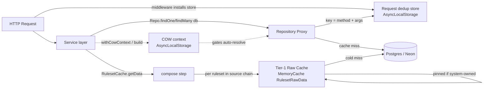
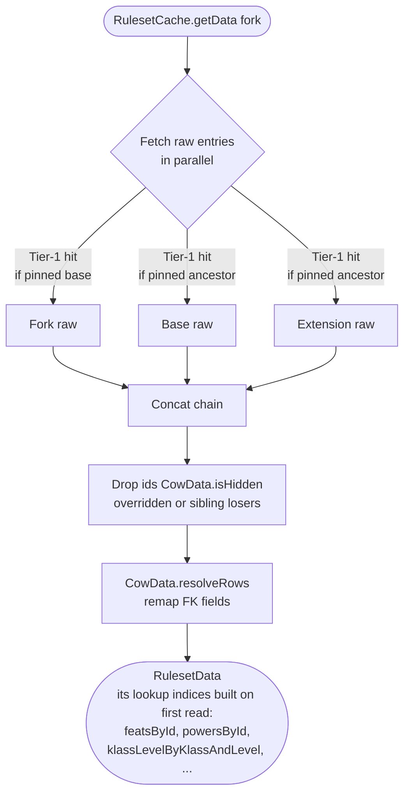
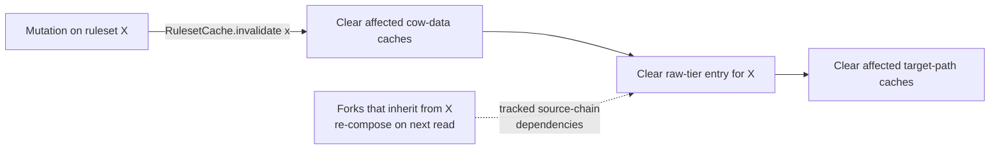
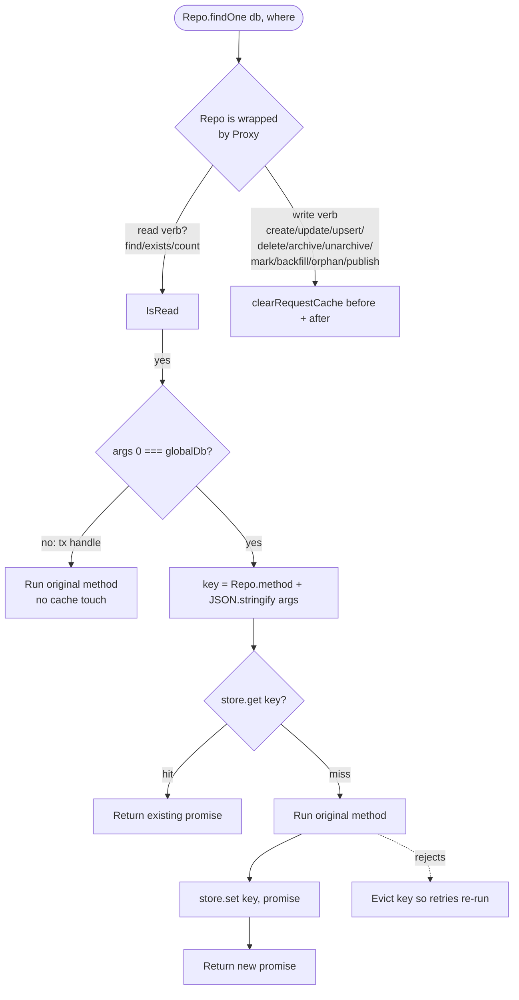
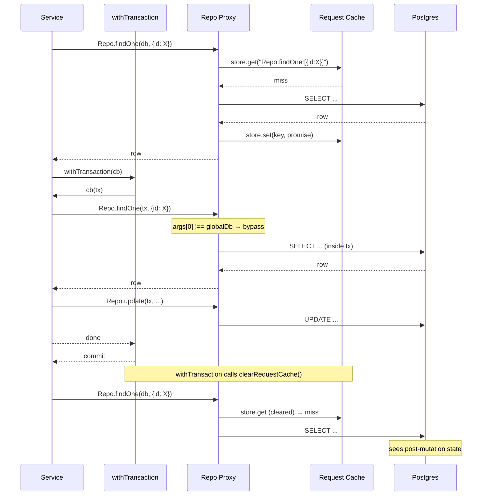
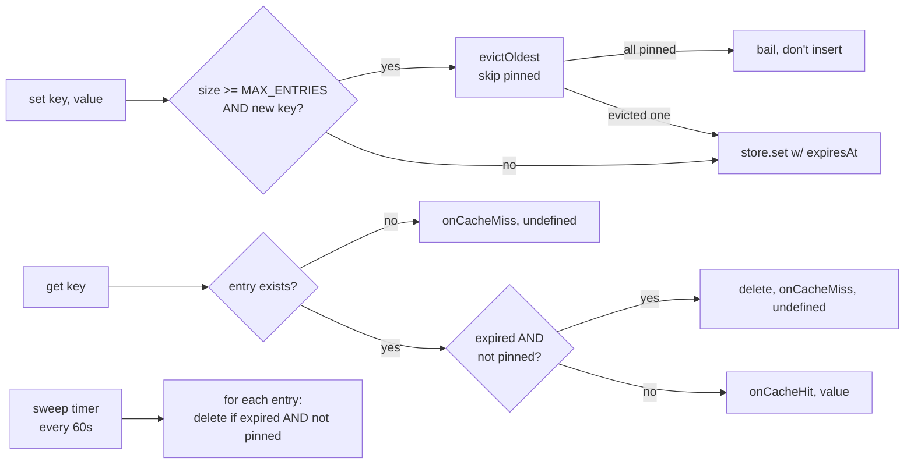
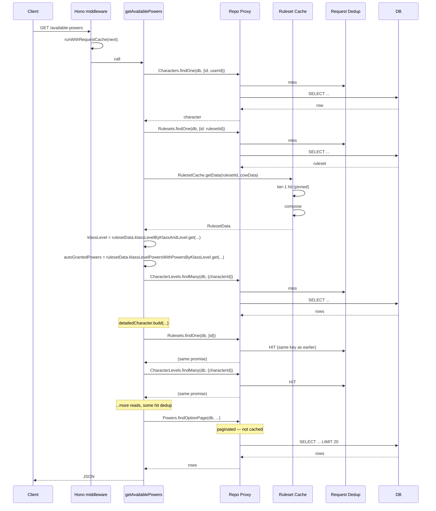

# Caching

## Overview

The server runs three cooperating layers, each solving a different problem:

| Layer                    | Scope                        | Lifetime                               | Shared by                           | Purpose                                                                                                      |
| ------------------------ | ---------------------------- | -------------------------------------- | ----------------------------------- | ------------------------------------------------------------------------------------------------------------ |
| **Ruleset cache**        | Per ruleset                  | Cross-request; pinned for system-owned | All requests for that ruleset       | Avoid re-reading the same ~thousand entity rows on every character read                                      |
| **Request-scoped dedup** | Per HTTP request             | One request                            | Any code in that request            | Collapse accidental duplicate queries (same SELECT, same args) fired by different layers in a single request |
| **COW context**          | Per ruleset-scoped operation | One async scope                        | The repos + cache inside that scope | Auto-remap stored pre-COW ids to post-COW so callers don't need to canonicalize manually                     |

The first two are in-memory data stores; the third is an AsyncLocalStorage-backed context that activates resolution behavior on the other two. Nothing is persisted. On process restart, everything is cold.

## How services interact with this

Services never call the cache or COW plumbing directly. The single entry point is one of two helpers from `server/cache/rulesetCache/`:

```ts
// Single-ruleset operation (every CRUD, character-scoped action):
return await withRulesetScope(tx, rulesetId, async ({ ruleset, rulesetData }) => {
  // ... read / write anything. Auto-COW is on.
});

// Multi-ruleset list enrichment (CharactersService.getCharacters / CampaignCharactersService.getCharacters):
return await withRulesetScopes(db, rulesetIds, async (rulesetDataByRulesetId) => {
  // ... stitch results from several rulesets. No ambient context
  // since only one can be active at a time; lookups use the map.
});
```

Inside the scope:

- `ruleset` — the ruleset row (non-null; throws `NotFoundError` if missing).
- `rulesetData` — the composed cache: `*ById` Maps, `klassLevelByKlassAndLevel`, `propertiesByEntity`, etc. Also `rulesetData.cow` exposes the underlying `CowData` (its `sourceChain`, `siblingIds`, and what an id resolves to: `resolve`, `isOverridden`, `isHidden`, `getWinner`) for lineage checks.
- A `cowContext` is activated, which turns on three automatic behaviours in the repository Proxy:
  1. **Input canonicalization** — `Items.findOne({ id: preCowId })` rewrites `id` to post-COW before hitting Postgres.
  2. **Output FK resolution** — returned rows have every `*Id` field remapped to post-COW.
  3. **Composite-key expansion** — `CharacterAbilities.update(tx, values, { characterId, abilityId })` matches both the pre-COW stored row and post-COW client input through `idMatches` (the `ResolvesCopies` concern).

COW ownership resolution needs stored IDs. Inside `cow/`, use `withCowContext(undefined, () => Modifiers.findOne(db, { id }))` for that lookup. This existing infrastructure scope disables remapping for the read and restores the caller's context afterward. SQL stays in the shared repository; ordinary service reads continue to use `withRulesetScope`.

**Callers don't think about COW for lookups.** `rulesetData.featsById.get(id)` works whether `id` is pre-COW or post-COW. Character-scoped repo reads (`CharacterLevels.findMany`, etc.) return rows whose `*Id` fields are already post-COW when they happen inside a scope. The only place you reach past the scope is ruleset management (publish, extensions and reverts in `RulesetsService`) and framework internals (the character loader, which reads its levels' picks as links and takes their entities from the view; `TargetPathsService` for path generation) — both use the primitives described below.


```mermaid
flowchart LR
    Req[HTTP Request] -->|middleware installs store| Store[Request dedup store<br/>AsyncLocalStorage]
    Req --> Svc[Service layer]
    Svc -->|Repo.findOne/findMany db| Proxy[Repository Proxy]
    Proxy -->|key = method + args| Store
    Proxy -->|cache miss| PG[(Postgres / Neon)]
    Svc -->|RulesetCache.getData| Compose[compose step]
    Compose -->|per ruleset in source chain| Raw[Tier-1 Raw Cache<br/>MemoryCache RulesetRawData]
    Raw -->|pinned if system-owned| Raw
    Raw -->|cold miss| PG
    Svc -.->|withCowContext / build| CowCtx[COW context<br/>AsyncLocalStorage]
    CowCtx -.->|gates auto-resolve| Proxy
```

## COW Transparency

### The problem

Ruleset entities can be [Copy-On-Write'd](./rulesets.md) in a fork. A COW creates a new entity with a new id; the ruleset's `CowData` (`engine/core/cow/CowData.ts`) records `preCowId → postCowId`. Characters saved **before** a COW store pre-COW ids in their rows (`level_feats.feat_id`, `character_abilities.ability_id`, ...). The composed ruleset cache is keyed by **post-COW ids**.

Without intervention, every lookup site had to remember to do `rulesetData.featsById.get(cow.resolve(storedId))`. Missing a call produced a silent cache miss. Three layers close the gap automatically.

### Layer 1 — cache id Maps auto-resolve on get/has

Every `*ById` / `*BySource` / `*ByEntity` Map returned by `RulesetCache.getData` is wrapped in a Proxy (`RulesetData`'s `resolvingIds`). `.get(key)` and `.has(key)` run the key through `CowData.resolve` first, then hit the underlying Map. `.size`, `.values()`, `.entries()`, iteration — all behave normally (no alias dup).

```ts
// storedFeatId may be pre-COW or post-COW; both land on the post-COW entity.
const feat = rulesetData.featsById.get(storedFeatId);
```

This covers ~30 lookup sites. Zero caller changes after the rollout. When the ruleset has no overrides (e.g. the base itself), the Proxy is skipped and the underlying Map is returned directly — zero overhead.

Also at compose time: the inline join rows on feats/powers (`powersAptitudesInRules[].aptitudeId`, `featsAptitudesInRules[].aptitudeId`, and their nested `aptitudesInRule` objects) are remapped and deduped. Earlier versions missed this because `CowData.resolveRows` only touches top-level string fields — nested arrays kept pre-COW ids and broke multi-extension sibling-dedup scenarios.

### Layer 2 — Character\* repo reads auto-resolve when a COW context is active

Every repository's reads (`find*`, `exists*`, `count*`) but `EntitySnapshots`' and `RulesetEntities`' (`skipCow`) have their results post-processed. The ones carrying stored ids are the Character\* repos' (`CharacterLevels`, `CharacterLevelFeats`, `CharacterLevelPowers`, `CharacterLevelSkills`, `CharacterAbilities`, `CharacterInventory`, `CharacterLanguages`). When a `cowContext` is active, every `*Id` field on every returned row is remapped to its post-COW form by `CowData.resolve` (`mapResultIds`, `server/repositories/copyOnWriteIds.ts`). A row's own `id` stays the stored one (a row stays the row it is), so a read that joins an entity row in hands it out under its stored id: a character's picks are read as links, whose `featId` / `powerId` / `skillId` are remapped, and their entities taken from the view.

```ts
// Inside a cowContext: row.klassLevelId / row.abilityId / row.featId /
// row.aptitudeId are all post-COW when they come back. Downstream code can
// compare them directly against rulesetData.*ById or client-submitted ids.
const rows = await CharacterLevels.findMany(tx, { characterId });
```

The request-dedup key for these calls includes a per-cowData identity tag, so two different cowContexts within the same request never share a resolved promise.

### Layer 3 — the context itself, set by `withRulesetScope`

`withRulesetScope(tx, rulesetId, fn)` is the single entry point. It:

1. Loads the ruleset (throws `NotFoundError("Ruleset not found")` if missing).
2. Gets `rulesetData` (`RulesetCache.getData`): its `CowData` from the COW cache (`RulesetCache.getCowData`), composed with the raw tier — both cached; warm cost is sub-millisecond.
3. Activates a cowContext via `withCowContext(rulesetData.cow, fn)` — AsyncLocalStorage-backed. The activation is a no-op if the `CowData` resolves no id (`isEmpty()`), so bases / extensions pay nothing.
4. Calls `fn({ ruleset, rulesetData })` — non-null invariants let callbacks skip defensive branches.

Every downstream read inside `fn` — including the character's rows an operation of the engine takes (`readCharacterInput`), a level save's writes (`finalizeLevelUp`), anything — sees the same context.

`withRulesetScopes(tx, rulesetIds, fn)` is the multi-ruleset variant for list endpoints that span characters from several rulesets at once. It pre-loads `rulesetData` for every unique id and hands the map to `fn`, without activating a cowContext (a single context can only represent one ruleset). Inside `fn`, all lookups go through the per-ruleset `rulesetData.*` Maps, which each resolve stored ids through their own ruleset's `CowData` and therefore still auto-resolve.

`withCowContext` / `getCowContext` are infrastructure primitives (`server/database/cowContext.ts`, marked `@internal`) — application code never calls them directly.

### When you DO need to think about COW

Rare but real:

- **Character-scoped composite-key stored rows.** `idMatches` (the `ResolvesCopies` concern, `server/repositories/concerns/`) already handles this for `CharacterAbilities` / `CharacterLanguages` / `CharacterLevel{Feats,Powers,Skills}`, and `CharacterInventory`'s in-use checks (an entry itself is found by its own id): inside cowContext, a composite WHERE on an entity-id column automatically expands to `IN (target, ...preCowIds)` to match legacy pre-COW rows. If you're adding a new character-scoped repo with a composite key on a forkable id field, use `this.idMatches(this.table.fooId, where.fooId)` in its `findOne` / `update` / `delete` predicates (see `CharacterLanguagesRepository` for the pattern).

- **Lineage checks that touch `rulesetId` fields.** `rulesetData.cow.sourceChain` is the ancestor chain. For validating that a submitted entity belongs to the character's ruleset or one of its ancestors, build `new Set([characterRecord.rulesetId, ...rulesetData.cow.sourceChain])` and check `.has(entity.rulesetId)` (or use `sourceChain.includes(entity.rulesetId)` when the self id isn't relevant). Examples: `CharacterInventoryService.addItem`, `CharactersService.updateLanguages`.

- **Multi-ruleset list enrichment.** Can't fit under a single `withRulesetScope`. Use `withRulesetScopes` — see `CharactersService.getCharacters` and `CampaignCharactersService.getCharacters`.

Manual resolution (`cow.resolve(id)` before a lookup, `cow.resolveRows(rows)`, `canonicalize(id)`) is handled by the repo Proxy and the `rulesetData.*` Map wrappers. If you find yourself tempted to write one, step back and check — you probably just need to be inside a scope.

## API surface

The cow + rulesetCache modules have two kinds of callers. The split is by ownership (who drives the flow), not by enforcement.

### Consumer API (services + routes)

From `server/cache/rulesetCache/` (the scopes) and `server/cow/` (the copies):

| Symbol                                  | Purpose                                                                                                                                                                         |
| --------------------------------------- | ------------------------------------------------------------------------------------------------------------------------------------------------------------------------------- |
| `withRulesetScope`                      | The single entry point for a single-ruleset operation.                                                                                                                          |
| `withRulesetScopes`                     | Multi-ruleset list enrichment.                                                                                                                                                  |
| `findScopedEntity`                      | The entity an id names in the composed view (the ruleset's own, or inherited through its source chain), or a 404.                                                               |
| `RulesetEdit`                           | One change to a ruleset's entities, built in its scope (`new RulesetEdit(ruleset, rulesetData.cow)`); each method takes the transaction.                                        |
| `RulesetEdit.cowToEdit` / `cowToDelete` | The row a CRUD update or delete writes: the ruleset's own entity, or the copy of an inherited one (`cowToDelete` locks its own).                                                |
| `RulesetEdit.cowOwner`                  | The row a customization create writes on: its owner, the ruleset's own (locked) or the copy of an inherited one (a class level's class copied with its levels).                 |
| `RulesetEdit.cowCustomization`          | Resolve the modifier / property / requirement row an update or delete changes: copies an inherited owner, maps the row to its copy, re-checks a local row after the owner lock. |
| `EntityCopy.create`                     | Fork an inherited entity into a ruleset: the copy, its customizations, relationships and merged siblings, and its snapshot.                                                     |
| `lockEntityForMutation`                 | Lock an already-local owner before deleting its customizations.                                                                                                                 |

For lineage checks (entity-belongs-to-sourceChain), `findScopedEntity`. For id canonicalization (pre-COW → post-COW) use `rulesetData.canonicalize(id)`. Sibling merging (aptitude links, modifiers, properties, requirements) is pre-baked into `rulesetData` by the compose step, so consumers only read `rulesetData.featsById`, `rulesetData.modifiersBySource`, etc. — never merge siblings themselves.

From `server/cache/rulesetCache/index.ts`: `RulesetCache`, the class that holds the cache (`RulesetCache.ts`). The view a read gets, `RulesetData` (`engine/core/view/`), is the engine's: `engine/index.ts` exports its type and composes it (`buildRulesetView`).

| Symbol                            | Purpose                                                                                               |
| --------------------------------- | ----------------------------------------------------------------------------------------------------- |
| `RulesetCache.invalidate`         | Clear the cache entries for a single ruleset. Call after every mutation.                              |
| `RulesetCache.invalidateEntities` | Same, but keep target-paths cache (used by customization mutations that don't change the entity set). |
| `RulesetCache.invalidateAll`      | Nuclear option — every ruleset. Used by tests and broad recomputations.                               |
| `RulesetCache.warm`               | Boot-time warm-up for pinned system rulesets. Called once from `server/main.ts`.                      |
| `RulesetData` (type)              | Parameter / return type for scope callbacks and framework extension points.                           |

`CowData`, the class `rulesetData.cow` is (`engine/core/cow/CowData.ts`), comes from `engine/index.ts` too: the cowContext holds it.

### Framework / copy primitives

Used by the copy flows, `RulesetsService` (publish), `RulesetExtensionsService`, `RulesetChangesService` (reverts) and the ruleset implementation layer (`DetailedCharacterDataLoader`, which resolves the rows it's given, `TargetPathsService`). Regular services don't reach for these — they go through `withRulesetScope`.

- **Copying customizations**: `fetchEntityCustomizations`, `copyEntityCustomizations`, `copyEntityCustomizationsToMany`. `EntityCopy` copies an inherited entity's customizations with them, and so do `ItemsService.duplicateItem` / `createVariants` and `ModifiersService.duplicateModifier`. `EntityCopy` also copies the entity's relationships and class levels and merges its siblings (its private methods).
- **Extensions** (`RulesetExtensionsService`): `subscribeExtension`'s name-clash check is the engine's (`checkExtensionNames`), which lets the types of `NAME_FALLBACK_ENTITY_TYPES` merge same-name entities from two extensions instead of rejecting them. Forking uses neither: a fork copies no entity rows (see [rulesets.md](./rulesets.md#forking)), and `EntityCopy` copies an entity on its first edit.
- **Copy-on-write data**: the engine builds a `CowData` (`buildCowData`, by its `CowDataBuilder`, `engine/core/cow/CowDataBuilder.ts`) from the rows its passes take, which the server reads as the engine's `getCowReads` says (`readCowData(database, ruleset)`, `cache/rulesetCache/cowData.ts`), one way, through the handle it's given: the shared `db` for its read side, which `RulesetCache.getCowData` caches, and a copy's transaction for its write side, which `EntityCopy` remaps a copy's references and merges its siblings by, seeing the transaction's own copies. It reads stored ids, copy-on-write resolution off.
- **Source-chain construction**: `buildSourceChain` (the engine's, `engine/core/cow/`), shared by `publishRuleset`, the COW data build (`RulesetCache.getCowData`, `EntityCopy`) and target-path cache keys.
- **Scope internals** (`withRulesetScope` wiring): `RulesetCache.getData`, which gets its `CowData` (`RulesetCache.getCowData`); `RulesetCache.invalidate*` drop it with the rest.
- **Row-level remaps** (`DetailedCharacterDataLoader` on character-scoped rows, read in or out of a scope): `CowData.resolveRows`. The entities they name are the view's (`rulesetData.featsById`…), never a joined row's.
- **Raw-tier test probes** (`tests/cache/rulesetCache/RulesetCache.test.ts`): `RulesetCache.getRawData`, `RulesetCache.isRawDataPinned`.
- **AsyncLocalStorage wiring**: `withCowContext`, `getCowContext` (`server/database/cowContext.ts`) — activated by `withRulesetScope`, read by the repo Proxy, `idMatches` (`ResolvesCopies`) and a ruleset entity list's sibling losers (`ScopesToRuleset`).

## Ruleset Cache

### What's in it

One tier: per-ruleset **raw** entities, keyed by `rulesetId[:campaignId]`. The composed view (what services actually consume) is built fresh on each call from these raw entries.

```ts
interface RulesetRawData {
  // Entities owned by this ruleset only — no ancestor merging.
  abilities: RulesetAbility[];
  saves: RulesetSave[];
  skills: Skill[];
  feats: Feat[];
  powers: PowerWithAptitudes[];
  aptitudes: Aptitude[];
  klasses: Klass[];
  races: Race[];
  languages: Language[];
  items: Item[];
  klassLevels: KlassLevel[];
  klassSkills: KlassSkill[];
  klassLevelFeats: KlassLevelFeat[];
  klassLevelPowers: KlassLevelPower[];
  klassLevelSaves: KlassLevelSave[];
  leveledAptitudeIds: Set<string>;
  properties: Property[];
  modifiers: Modifier[];
  requirements: Requirement[];
}
```

The fork and each ancestor in its source chain gets its own entry. Bases + published extensions (`system: true`) are shared across every fork that descends from them.

### Why two tiers weren't needed

An earlier design cached the fully-composed `RulesetData` per fork. That duplicated the base's entities into every fork's cache entry — ~500 forks × a hot D&D 3.5 base = ~500× RAM waste and ancestor data evicted under load. The raw-tier-only design pins the base once and re-composes on read (sub-millisecond over arrays of a few hundred entities).

### Compose step


```mermaid
flowchart TD
    Start([RulesetCache.getData fork]) --> Fetch{Fetch raw entries<br/>in parallel}
    Fetch -->|Tier-1 hit<br/>if pinned base| ForkRaw[Fork raw]
    Fetch -->|Tier-1 hit<br/>if pinned ancestor| BaseRaw[Base raw]
    Fetch -->|Tier-1 hit<br/>if pinned ancestor| ExtRaw[Extension raw]
    ForkRaw --> Concat[Concat chain]
    BaseRaw --> Concat
    ExtRaw --> Concat
    Concat --> Exclude[Drop ids CowData.isHidden<br/>overridden or sibling losers]
    Exclude --> FKRemap[CowData.resolveRows<br/>remap FK fields]
    FKRemap --> Out([RulesetData<br/>its lookup indices built on first read:<br/>featsById, powersById,<br/>klassLevelByKlassAndLevel, ...])
```

Roughly: concat arrays from fork+ancestors → drop COW'd ids and sibling ids → apply FK remap. The id-indexed Maps for O(1) lookups are `RulesetData`'s getters, each built the first time it's read.

`CowData`'s sibling losers come in two flavors, paired by the engine's `CowDataBuilder` (`engine/core/cow/CowDataBuilder.ts`): (1) entity-level COW siblings — multiple extensions COW'd the same base entity; (2) aptitude-name collisions — independently-created copies of the same aptitude name across the chain, typically sibling-shared class spell lists like `Assassin Spells`. Both are treated identically by the compose step: losers dropped from the entities array, FKs remapped to the winner. Base-inherited aptitudes (`General`, `Cleric Domain`, etc.) are not duplicated at seed time (see `docs/packages.md`), so they don't participate.

### Pinning

System-owned rulesets (`rulesets.system = true`) get `cache.pin(key)` on first fetch so TTL, sweep, and LRU eviction all skip them. User forks still use normal LRU + 5-min TTL.

The underlying `MemoryCache` capacity is 200 entries. With ~30 system-owned rulesets pinned, 170 slots remain for the user-fork working set.

Safety: if everything in the cache is pinned and you try to insert a non-pinned entry, `set()` bails rather than growing past `MAX_ENTRIES`.

### Warm-up

`RulesetCache.warm()` runs at boot (`server/main.ts`). It pulls every `system: true` ruleset and triggers `RulesetCache.getRawData` for each so the first user of the day doesn't pay the cold cost. Typically ~7 rulesets × a few hundred ms each = ~1 second of added boot time.

### Invalidation


```mermaid
flowchart LR
    Mut[Mutation on ruleset X] -->|RulesetCache.invalidate x| IR[Clear affected cow-data caches]
    IR --> CR[Clear raw-tier entry for X]
    CR --> TP[Clear affected target-path caches]
    Note[Forks that inherit from X<br/>re-compose on next read] -.->|tracked source-chain<br/>dependencies| CR
```

`RulesetCache.invalidate(id)` clears that ruleset's raw entries (including campaign variants), plus COW and target-path entries whose source chain contains it. Unrelated cached entries and in-flight reads remain reusable. `DependentCache` records source-chain IDs alongside each bounded cache entry and pending read; invalidation requires no database lookup and scans at most 200 cached entries per tier plus active reads.

Three calls:

| Call                                  | Clears                                                               | Use when                                                                                                                                                         |
| ------------------------------------- | -------------------------------------------------------------------- | ---------------------------------------------------------------------------------------------------------------------------------------------------------------- |
| `RulesetCache.invalidateEntities(id)` | Raw entities for this ruleset + dependent COW data; not target paths | Entity data (description, stats) edited                                                                                                                          |
| `RulesetCache.invalidate(id)`         | Raw entities for this ruleset + dependent COW data and target paths  | Entities added/removed/renamed, or a modifier written: a list's slots and joins decide which lists have spell levels and known-spell paths (target paths change) |
| `RulesetCache.invalidateAll()`        | Every ruleset's everything                                           | Test teardown, rare                                                                                                                                              |

In tests, the cache reads through the test's transaction and outlives its rollback: rows a test writes straight into a seeded ruleset stay cached once a read rebuilds that ruleset. Tests write into forks instead, or call `invalidateSeededRuleset` (`tests/support/rulesets.ts`), which `tests/setup.ts` repeats after the rollback.

### Lookup indices (accessor maps)

Services used to query the DB for single rows even after the cache was warm. The composed view now exposes pre-built Maps over the arrays so consumers do O(1) lookups without round-tripping Postgres:

| Index                                                                                                                                                                                | Holds                                                                                                                                                      |
| ------------------------------------------------------------------------------------------------------------------------------------------------------------------------------------ | ---------------------------------------------------------------------------------------------------------------------------------------------------------- |
| `featsById`, `powersById`, `skillsById`, `aptitudesById`, `abilitiesById`, `savesById`, `klassesById`, `racesById`, `languagesById`, `itemsById`, `mechanicsById`, `klassLevelsById` | Each entity of the composed view by id (a stored pre-COW id resolves to its copy)                                                                          |
| `klassLevelByKlassAndLevel` (key `${klassId}:${level}`)                                                                                                                              | A class's level                                                                                                                                            |
| `klassLevelsByKlassId`                                                                                                                                                               | A class's levels, sorted: the last its highest                                                                                                             |
| `propertiesByEntity`                                                                                                                                                                 | An entity's properties                                                                                                                                     |
| `propertiesByEntityType` (key `"items"` / `"powers"` / `"rulesets"` / ...)                                                                                                           | Every property of one entity type                                                                                                                          |
| `klassLevelFeatsWithFeatsByKlassLevel`, `klassLevelPowersWithPowersByKlassLevel`                                                                                                     | A class level's feats and powers, each with its entity                                                                                                     |
| `klassSkillsWithSkillsByKlass`, `klassSkillsByKlassId`                                                                                                                               | A class's skills, with or without each skill                                                                                                               |
| `klassLevelSavesByKlassLevelId`                                                                                                                                                      | A class level's saves                                                                                                                                      |
| `aptitudeIdsByHavingPowers`                                                                                                                                                          | The aptitudes some power belongs to                                                                                                                        |
| `modifiersBySource`                                                                                                                                                                  | A source's modifiers                                                                                                                                       |
| `requirementsByEntity`                                                                                                                                                               | An entity's requirements                                                                                                                                   |
| `entityIdsByPropertyLookup` (key `${entityType}:${type}:${value}`)                                                                                                                   | The entities with a property value                                                                                                                         |
| `klassLevelFeatsByKlassLevel`                                                                                                                                                        | A class level's feat rows, without their feats                                                                                                             |
| `modifiersById`                                                                                                                                                                      | Each modifier by id                                                                                                                                        |
| `leveledAptitudeIds`                                                                                                                                                                 | The aptitudes counted by spell level (spell pools)                                                                                                         |
| `aptitudeIdBySlug`, `featIdBySlug`, `powerIdsBySlug`                                                                                                                                 | An aptitude, feat or powers by the slug a target path names them by (the modifier scans for `feats.<slug>.possessed` and `powers.<slug>.<aptitude>.known`) |

Each is a getter of `RulesetData` (`engine/core/view/RulesetData.ts`), built from the composed lists the first time it's read and kept with the view: a request pays for the indices it reads. Building every one costs about 2.5 ms on the core ruleset and 10 ms on a fork using every extension, on top of composing its lists (under 1 ms and about 14 ms).

Every id-keyed Map in this table is wrapped by `RulesetData.resolvingIds` — `.get(key)` / `.has(key)` auto-resolve `key` through `CowData.resolve`. Callers can pass stored pre-COW ids directly.

The flat `properties` / `modifiers` / `requirements` arrays were removed from `RulesetData` — they encouraged scans (`arr.filter(p => set.has(p.entityId))`) that were all replaced with one of the Maps above. Sibling-sourced rows are pre-merged by the compose step into the winner's bucket (sourceId / entityId remapped, deduped), so every index above already reflects the full multi-extension view — consumers never see sibling-loser rows.

### What's not in the ruleset cache (and why)

Character-scoped tables (the `character` schema): `characters`, `levels`, `character_abilities`, `languages`, `inventory`, `level_feats` / `level_powers` / `level_skills`, character-sourced modifiers. These change per character per mutation; cross-request cache hit rate would be ~0%. They're served by the request-scoped dedup layer when the same query fires twice in one request.

Paginated / searched / filtered queries (e.g. `Feats.findPage({ search, pagination })`): too many unique keys to make a shared cache useful. These go straight to Postgres.

## Request-Scoped Query Dedup

### What it does

Within a single HTTP request, two calls to the same `Repo.findOne(db, ...)` / `Repo.findMany(db, ...)` with the same args return the same `Promise`. The second caller piggybacks on the first's in-flight query — no second round trip.

Why this matters: our read paths have legitimate architectural duplicates. `powerPicks.getAvailablePowers` finds the character the session may edit (`Characters.findOne`), then `readCharacterInput` reads its rows — some the outer function already looked up.

### How it works


```mermaid
flowchart TD
    Start([Repo.findOne db, where]) --> Proxy{Repo is wrapped<br/>by Proxy}
    Proxy -->|read verb?<br/>find/exists/count| IsRead
    IsRead -->|yes| IsDb{args 0 === globalDb?}
    IsDb -->|no: tx handle| Direct[Run original method<br/>no cache touch]
    IsDb -->|yes| Key[key = Repo.method + JSON.stringify args]
    Key --> Store{store.get key?}
    Store -->|hit| Return[Return existing promise]
    Store -->|miss| Run[Run original method]
    Run --> Save[store.set key, promise]
    Save --> ReturnNew[Return new promise]
    Run -.->|rejects| Evict[Evict key so retries re-run]
    Proxy -->|write verb<br/>create/update/upsert/<br/>delete/archive/unarchive/<br/>mark/backfill/orphan/publish| Clear[clearRequestCache before + after]
```

The store is an `AsyncLocalStorage<Map<string, Promise<unknown>>>` installed by a Hono middleware:

```ts
.use("*", async (_, next) => runWithRequestCache(async () => { await next(); }))
```

Every request gets a fresh `Map`; the store dies with the request. Zero cross-request leakage.

### Tx bypass

Mutations use `withTransaction((tx) => ...)` which passes `tx` (not the global `db`) to repos. The Proxy's identity check `args[0] === globalDb` sees `tx` is not `globalDb` and bypasses the dedup entirely. This is the invariant that prevents an in-flight tx's uncommitted state from leaking to other contexts sharing the same request.


```mermaid
sequenceDiagram
    participant Svc as Service
    participant Tx as withTransaction
    participant Repo as Repo Proxy
    participant Cache as Request Cache
    participant DB as Postgres

    Svc->>Repo: Repo.findOne(db, {id: X})
    Repo->>Cache: store.get("Repo.findOne:[{id:X}]")
    Cache-->>Repo: miss
    Repo->>DB: SELECT ...
    DB-->>Repo: row
    Repo->>Cache: store.set(key, promise)
    Repo-->>Svc: row

    Svc->>Tx: withTransaction(cb)
    Tx->>Svc: cb(tx)
    Svc->>Repo: Repo.findOne(tx, {id: X})
    Note over Repo: args[0] !== globalDb → bypass
    Repo->>DB: SELECT ... (inside tx)
    DB-->>Repo: row
    Repo-->>Svc: row
    Svc->>Repo: Repo.update(tx, ...)
    Repo->>DB: UPDATE ...
    Svc-->>Tx: done
    Tx-->>Svc: commit
    Note over Tx, Cache: withTransaction calls clearRequestCache()

    Svc->>Repo: Repo.findOne(db, {id: X})
    Repo->>Cache: store.get (cleared) → miss
    Repo->>DB: SELECT ...
    Note over DB: sees post-mutation state
```

### Invalidation

Three points clear the store:

1. **Write method called through the Proxy** (`create`, `update`, `archive`, `unarchive`, `restore`, `delete*`, `save*`, `upsert*`, `insert*`, `link*`, `unlink*`, `orphan*`): clear before and after the call. Covers direct-to-`db` writes.
2. **`withTransaction` post-commit**: the hook in `server/database/{production,test}.ts` calls `clearRequestCache()` after `db.transaction()` returns. Covers tx-based writes.
3. **Manual `clearRequestCache()`**: exported for explicit invalidation from callers that know they've changed state through some other path.

Failed promises self-evict so a retry doesn't return the cached rejection.

### Observability

The request log line gets a `dedup: N/M` segment whenever dedup activity happened:

```
[api] 2026-04-16T... --> GET /api/characters/:id/available-powers 200 220ms (db: 180ms cpu: 40ms q: 8 cache: 4/4 dedup: 6/12)
```

- `cache: H/T` — ruleset cache hits / total lookups (set by `onCacheHit`/`onCacheMiss` in `MemoryCache`)
- `dedup: H/T` — request-scoped dedup hits / total memoize calls (set by `onDedupHit`/`onDedupMiss` in `requestCache`)

Counters live on the timing store (`server/timing.ts`) alongside query count / db time / cpu time.

## MemoryCache (underlying)

Both the ruleset raw-tier cache and the target-paths cache use `MemoryCache<T>`:


```mermaid
flowchart LR
    Set[set key, value] --> Cap{size >= MAX_ENTRIES<br/>AND new key?}
    Cap -->|yes| Evict[evictOldest<br/>skip pinned]
    Evict -->|all pinned| Bail[bail, don't insert]
    Evict -->|evicted one| Insert
    Cap -->|no| Insert[store.set w/ expiresAt]
    Get[get key] --> Entry{entry exists?}
    Entry -->|no| Miss[onCacheMiss, undefined]
    Entry -->|yes| Exp{expired AND<br/>not pinned?}
    Exp -->|yes| Del[delete, onCacheMiss, undefined]
    Exp -->|no| Hit[onCacheHit, value]
    Sweep[sweep timer<br/>every 60s] --> Scan[for each entry:<br/>delete if expired AND not pinned]
```

- **TTL**: 5 min default. Ignored for pinned keys.
- **LRU eviction**: at capacity, evict the entry with the earliest expiration. Pinned keys skipped.
- **Sweep**: every 60s, delete expired non-pinned entries. Timer is `unref`d so it doesn't hold the process alive.
- **Disable knob**: set `DISABLE_CACHE=true` to make every `get` miss and every `set` a no-op (for debugging).

## End-to-end example: `GET /api/characters/:id/available-powers`

With both cache layers warm:


```mermaid
sequenceDiagram
    participant Client
    participant Middle as Hono middleware
    participant Svc as getAvailablePowers
    participant Repo as Repo Proxy
    participant RS as Ruleset Cache
    participant Dedup as Request Dedup
    participant DB

    Client->>Middle: GET /available-powers
    Middle->>Middle: runWithRequestCache(next)
    Middle->>Svc: call
    Svc->>Repo: Characters.findOne(db, {id, userId})
    Repo->>Dedup: miss
    Repo->>DB: SELECT ...
    DB-->>Repo: row
    Repo-->>Svc: character

    Svc->>Repo: Rulesets.findOne(db, {id: rulesetId})
    Repo->>Dedup: miss
    Repo->>DB: SELECT ...
    DB-->>Repo: ruleset

    Svc->>RS: RulesetCache.getData(rulesetId, cowData)
    RS->>RS: tier-1 hit (pinned)
    RS->>RS: compose
    RS-->>Svc: RulesetData

    Svc->>Svc: klassLevel = rulesetData.klassLevelByKlassAndLevel.get(...)
    Svc->>Svc: autoGrantedPowers = rulesetData.klassLevelPowersWithPowersByKlassLevel.get(...)

    Svc->>Repo: CharacterLevels.findMany(db, {characterId})
    Repo->>Dedup: miss
    Repo->>DB: SELECT ...
    DB-->>Repo: rows

    Note over Svc: detailedCharacter.build(...)
    Svc->>Repo: Rulesets.findOne(db, {id})
    Repo->>Dedup: HIT (same key as earlier)
    Repo-->>Svc: (same promise)

    Svc->>Repo: CharacterLevels.findMany(db, {characterId})
    Repo->>Dedup: HIT
    Repo-->>Svc: (same promise)

    Note over Svc: ...more reads, some hit dedup

    Svc->>Repo: Powers.findOptionPage(db, ...)
    Note over Repo: paginated — not cached
    Repo->>DB: SELECT ... LIMIT 20
    DB-->>Repo: rows
    Repo-->>Svc: rows
    Svc-->>Client: JSON
```

## Adding a new entity to the ruleset cache

1. Add the entity's type + an array field to `RulesetRawData` in `engine/core/view/RulesetComposition.ts`, and its fetch to `server/cache/rulesetCache/rawData.ts`.
2. Fetch it in the appropriate round of `fetchRulesetRawData` (rounds gate on dependencies — klass-level fetches need `klasses` first, customizations need all entity IDs).
3. Add the composed array to `RulesetLists` and to `RulesetData` (`engine/core/view/RulesetData.ts`).
4. Extend the compose step (`RulesetComposition`): concat across chain without the hidden rows (`this.composeRows`, which filters `cow.isHidden(id)`) → `cow.resolveRows` if it has FKs.
5. Add a `<entity>ById` getter to `RulesetData`, like `featsById`: built on first read (`this.built.<entity>ById ??= …`) from `buildById(this.<entities>)` **and** wrapped with `this.resolvingIds(map)` so `.get` auto-resolves stored pre-COW ids.
6. If callers need a filter like "X by Y", add that index as a getter too, wrapped the same way.
7. If the entity carries inline join arrays (like `powersAptitudesInRules`), remap the nested ids in the compose step too — `CowData.resolveRows` only touches top-level fields.
8. Update `tests/cache/rulesetCache/RulesetCache.test.ts` with a smoke test (the existing compose+invalidation patterns are copy-paste templates); include a COW-fork assertion so regressions in the auto-resolve path are caught.
9. Migrate callers: `Repo.findOne(db, { id })` inside a `withRulesetScope` → `rulesetData.<entity>ById.get(id)`. No canonicalize needed — the wrapper handles it. Either access pattern works; the cache Map is preferred when you already have `rulesetData` in scope.

## A repository method's verb

The Proxy classifies a method by its verb, its first camelCase word (`find` in `findOneWithBlob`, `mark` in `markRead`), against `server/repositories/methodVerbs.json`: a `read` (`find`, `exists`, `count`) is memoized and sees copy-on-write ids, a `write` (`create`, `update`, `upsert`, `delete`, `archive`, `unarchive`, `mark`, `backfill`, `orphan`, `publish`) clears the cache before and after, and a `lock` does neither. Lint (`arkyvree/method-names`) holds every public repository method to one of these verbs, so a new method is classified by its name, with nothing to update here.

A new kind of write takes an existing verb (`updateStatus`, not `setStatus`). A verb added to `methodVerbs.json` joins its class for every repository at once: a read verb would memoize, a write verb would clear.

## References

- `server/cache/MemoryCache.ts` — TTL + LRU + pin primitive
- `server/cache/rulesetCache/` — `RulesetCache` (`RulesetCache.ts`: the raw-tier and target-paths caches, the composed reads, invalidation and the boot warm-up; the engine composes a read's view, `buildRulesetView`, in its module's property order), and the raw rows' fetch (`rawData.ts`)
- `server/cache/rulesetCache/` (copy-on-write's read side) — `withRulesetScope` / `withRulesetScopes` (`scope.ts`), and the rows the COW data is built from (`readCowData`, `cowData.ts`; `RulesetCache` caches and invalidates it)
- `engine/core/view/` — the compose step with its sibling merging and FK remap (`RulesetComposition.ts`, with `RulesetRawData`, the rows it takes; `buildRulesetView`, `engine/api/rulesets.ts`, runs it), the view it builds, whose lookup indices and resolving maps are built on first read (`RulesetData.ts`), the sibling merge's rules, which the compose step and a copy share (`siblingMerge.ts`), and the list the compose step gathers a merge's rows in (`SiblingRows.ts`)
- `server/cow/` (copy-on-write's write side) — `RulesetEdit` (the rows a change writes, names a create takes), `EntityCopy` (a copy of an inherited entity), the copy primitives (`copyCustomizations.ts`)
- `engine/core/cow/` — a ruleset's copy-on-write state (`CowData.ts`: what an id resolves to, and whether it's overridden or a sibling loser), its build from rows (`CowDataBuilder.ts`: the snapshot, sibling, name, class-level and aptitude passes), and what it's read from (`sources.ts`: `buildSourceChain`, `getCowReads`, `NAME_FALLBACK_ENTITY_TYPES`)
- `server/database/cowContext.ts` — AsyncLocalStorage cowContext, `withCowContext` / `getCowContext` (infrastructure)
- `server/database/requestCache.ts` — AsyncLocalStorage-backed dedup
- `server/repositories/withRequestCache.ts` — Proxy wrapping every repo (its shared instance in `server/repositories/index.ts`) with dedup + write invalidation + cowContext-driven input canonicalization + output FK auto-resolve
- `server/repositories/concerns/ResolvesCopies.ts` — `idMatches()` predicate for cowContext-aware composite-key WHERE clauses
- `server/services/characters/characterInputs.ts` — `readCharacterInput` reads a character's rows in its ruleset's scope (the caller's), and a bonded creature's master's with them: what the engine builds the character from (`buildCharacter`, `engine/rulesets/dnd3.5/character/buildCharacter.ts`), its master first
- `engine/rulesets/dnd3.5/character/concerns/Builds.ts` — `build(rows, view, projected, master)` reads nothing: the data loader assembles the character's data from the rows and the view
- `server/timing.ts` — hit/miss counters surfaced in request logs
- `tests/cache/rulesetCache/RulesetCache.test.ts` — compose + invalidation + pinning semantics + COW-fork auto-resolve
- `tests/cache/joinMaps.test.ts` — accessor-map parity with replaced repo queries
- `tests/cache/requestCache.test.ts` — dedup semantics + tx bypass + post-mutation invalidation
- `tests/services/characters/levels/CharacterLevelsService.test.ts` — COW fork regression (wizard prohibited-school feat COW'd)

The PDF worker disables process-wide MemoryCache reuse so each job reads current rules after web edits. Web requests keep their raw cache. Each in-flight read uses its promise identity as a token for its cache key. Invalidation removes only reads depending on the edited ruleset; a late completion may finish for its caller but cannot repopulate the cache or remove a newer pending read. This replaces global generation counters without an unbounded per-ruleset counter registry.

Raw-tier and COW-map reads explicitly clear the ambient COW context. A nested
character build (for example, a familiar loading its master) must load stored
IDs before composing them for its own ruleset. Even a scope with an empty map
replaces the outer scope. With process caching disabled, raw reads also bypass
the process-wide in-flight map so separate worker jobs do not share old reads.

Shared cache fills run in their own request-dedup scope. An older HTTP request
must not refill an invalidated process cache from promises it cached before a
concurrent edit. Reads within each fill still deduplicate. COW and target-path
cache keys include the ordered source chain, so old subscription metadata cannot
replace entries for a newly subscribed or unsubscribed ruleset.

Target-path composition happens inside the registered cache fill, not before it.
This lets invalidation reject a late fill throughout composition and generation.
A path cache hit reads ruleset metadata but skips composition; entity-only
invalidation still preserves paths, and unrelated rulesets remain cached.
